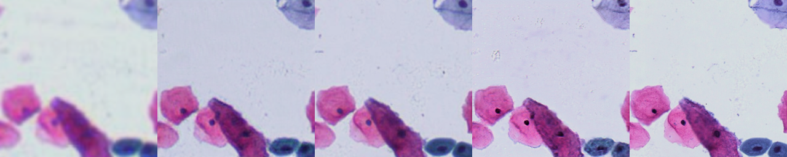

# PathSRGAN: Multi-Supervised Super-Resolution for Cytopathological Images Using Generative Adversarial Network
The implementation of PathSRGAN.
## Model
Model and toolkits can be found at lib directory. 
We recommend Pycharm to avoid dependency problems.
## Train
see train.py and for more details. 
## Test
To test the pretrained model, run following instruction: 
```shell
python predict.py
```
then you will find generated MR and HR images at asset/images directory. 
a sample:

<center>4x----reconstructed 10x----10x----reconstructed 20x----20x </center> 

## Citation
@ARTICLE{9036984,
  author={J. {Ma} and J. {Yu} and S. {Liu} and L. {Chen} and X. {Li} and J. {Feng} and Z. {Chen} and S. {Zeng} and X. {Liu} and S. {Cheng}},
  journal={IEEE Transactions on Medical Imaging}, 
  title={PathSRGAN: Multi-Supervised Super-Resolution for Cytopathological Images Using Generative Adversarial Network}, 
  year={2020},
  volume={39},
  number={9},
  pages={2920-2930},
  doi={10.1109/TMI.2020.2980839}}